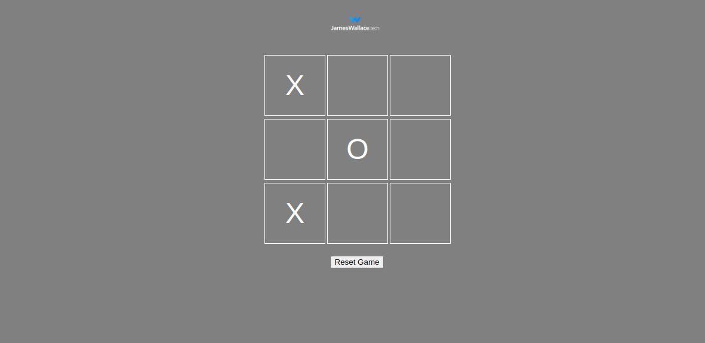

# Tic-Tac-Toe Game

A simple, responsive Tic-Tac-Toe game built with HTML, CSS, and JavaScript.

## How to Play

1. Open the `index.html` file in your web browser.
2. The game starts with Player X.
3. Click on an empty cell to make your move.
4. The game will automatically switch turns between X and O.
5. The first player to get three of their symbols in a row (horizontally, vertically, or diagonally) wins.
6. If all cells are filled and no player has won, the game is a draw.
7. Click the "Reset Game" button to start a new game at any time.

## Installation

1. Clone this repository 
2. Open the `index.html` file in your web browser.

No additional installation or setup is required!

## Technologies Used

- HTML5
- CSS3
- JavaScript (ES6+)

